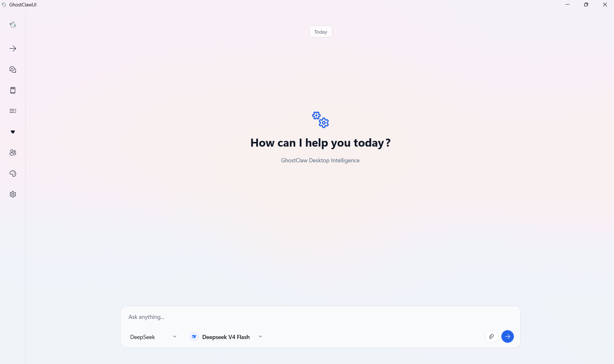
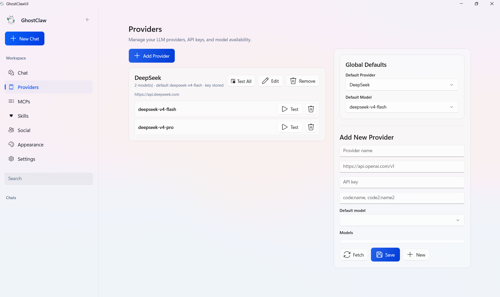
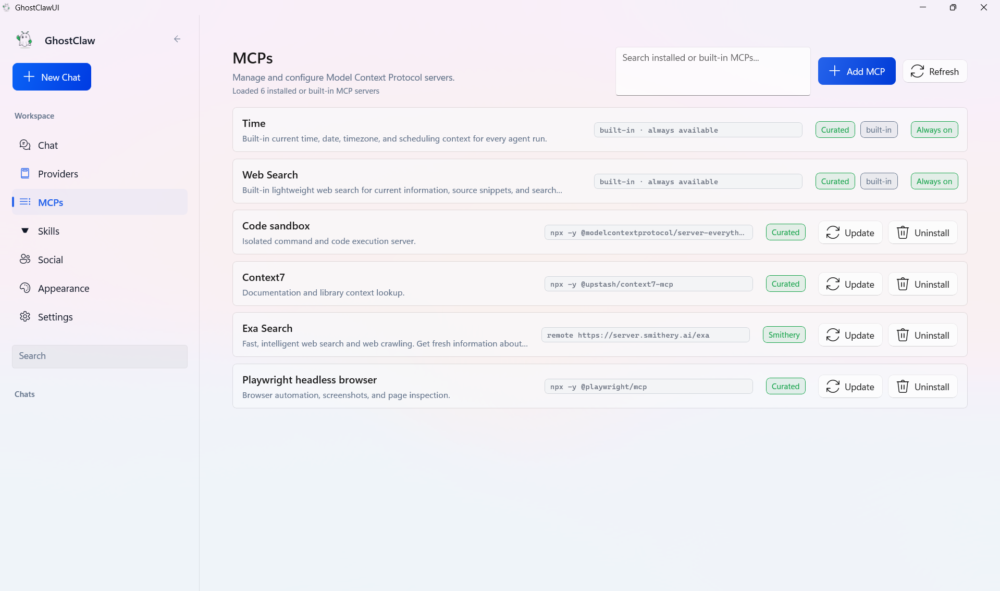
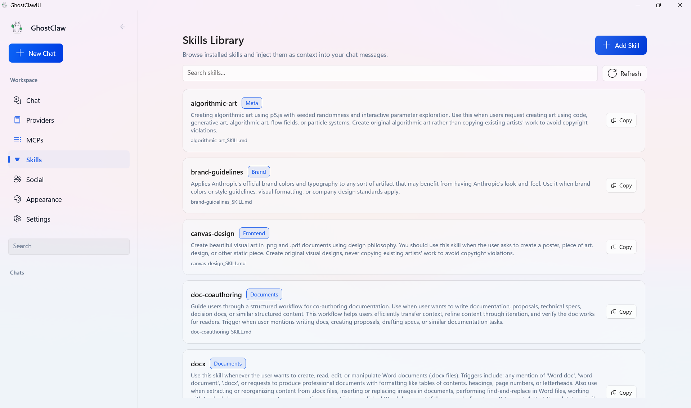
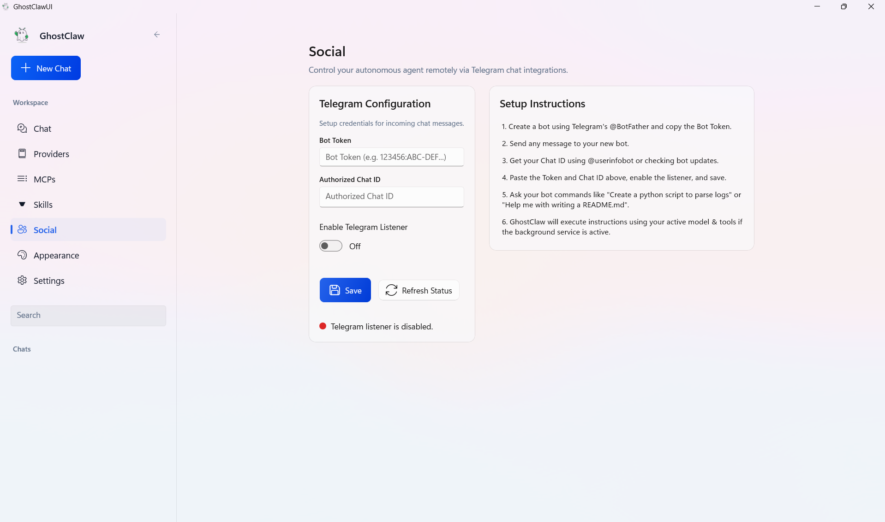

# GhostClawUI
[](https://deepwiki.com/HappyGamerGoose/GhostClawUI)

GhostClawUI is a powerful, deeply-integrated native Windows Desktop client for interacting with AI Agents. Built from the ground up using **WinUI 3** and **.NET 10**, it offers a lightning-fast, highly optimized interface that connects directly to your local file system, tools, and background processes.

Unlike standard web-based AI clients, GhostClawUI brings autonomous agent capabilities directly to your desktop.

## Features

- **Blazing Fast Native UI**: Built with WinUI 3 for a beautiful, responsive, and native Windows 11 experience.
- **Model Context Protocol (MCP)**: Native integration with MCP servers (Code Sandbox, Web Search, Playwright) allowing the agent to perform real work on your machine.
- **Provider Agnostic**: Easily swap between DeepSeek, OpenAI, Anthropic, or any other compatible LLM provider.
- **Telegram Integration**: A built-in background listener allows you to message your desktop agent remotely from your phone via Telegram.
- **Skills Library**: Inject specialized context and guidelines dynamically into your conversations.
- **Local Memory & Privacy**: All chat history and API keys are stored securely on your local machine (using Windows Credential Manager and SQLite), ensuring complete data privacy.

---

## Gallery

### The Workspace
A clean, distraction-free environment to collaborate with your AI agent.


### Multi-Provider Support
Configure and switch between multiple LLM providers and models on the fly.


### Model Context Protocol (MCP)
Supercharge your agent by connecting it to local execution environments, web search, and browser automation.


### Skills Library
Curated system prompts and capabilities you can inject into any conversation.


### Remote Telegram Access
Configure the built-in background service to listen for Telegram messages, allowing you to command your desktop agent remotely.


---

## Installation & Setup

### For Users
Download the latest portable release from the **[Releases](../../releases)** tab.
1. Extract the `.zip` file.
2. Right-click `install.bat` and select **Run as Administrator**.
3. Launch **GhostClawUI** from your Windows Start Menu!

### For Developers
If you want to build the project from source:

#### Prerequisites
- Windows 10/11
- Visual Studio 2022 (with Windows App SDK / WinUI 3 workloads)
- .NET 10 SDK

#### Build Instructions
1. Clone the repository:
   ```bash
   git clone https://github.com/HappyGamerGoose/GhostClawUI.git
   cd GhostClawUI
   ```
2. Open `GhostClawUI.sln` in Visual Studio.
3. Set `GhostClawUI.App` as the startup project.
4. Build and run using the `x64` platform configuration.

---

## Architecture

The application is split into two primary components:
1. **GhostClawUI.App**: The WinUI 3 frontend application that provides the rich user interface.
2. **GhostClawUI.Service**: A robust background daemon that manages the SQLite database, MCP server processes, Telegram polling, and securely orchestrates LLM API calls.

They communicate via a high-performance Named Pipe IPC connection to ensure the UI thread remains completely unblocked.

## Credits

This project is a native UI built upon the original **[GhostClaw](https://github.com/b1rdmania/ghostclaw)** autonomous agent framework. All credit for the core agent architecture goes to the original creator!

## License

Apache License 2.0. See `LICENSE` for more information.
